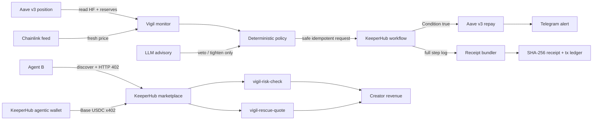

# Vigil

Vigil is a self-funding liquidation guardian for Aave v3. It monitors a
position, applies deterministic safety policy, rescues an at-risk account
through KeeperHub, sells paid risk intelligence over x402, and produces a
tamper-evident receipt for every rescue.

The project has real proofs on both sides of the product:

- a KeeperHub-executed Aave rescue on Sepolia raised health factor from
  `1.1786` to `1.5000`; and
- a second agent paid `$0.02` Base USDC through KeeperHub to call
  `vigil-risk-check`.

[Rescue transaction](https://sepolia.etherscan.io/tx/0xa03a49a8213415e9fc0ec53c423c707ed2c869b92841781c4174abced9a958bb)
·
[x402 payment](https://basescan.org/tx/0x440baa100eb85a9b586ead523c05a1918247fccb610098718e2f2fd0317d4122)
·
[Demo video](./demo/vigil-keeperhub-demo.mp4)
·
[Full milestone evidence](./PROGRESS.md)

## Architecture



The execution guardian intentionally remains on Sepolia. The two paid,
read-only products use Aave Base after explicit mainnet authorization so their
application chain matches KeeperHub's Base USDC settlement rail.

## Safety model

Vigil separates decision authority from execution infrastructure:

- deterministic policy owns the HF threshold, cooldown, per-rescue cap, daily
  cap, and position/block-range idempotency key;
- the LLM advisory schema has no `allow` field and can only veto, lower a spend
  cap, or increase a cooldown;
- every state-changing Aave contract call in the rescue path is simulated and
  submitted through KeeperHub;
- retries stop after three attempts and classify gas, revert, nonce, RPC, and
  unknown failures from `get_execution`;
- a confirmed write is never retried because a later Telegram step failed;
- transaction hashes and KeeperHub execution IDs are appended to
  `ledger/txs.json`; and
- receipt SHA-256 is calculated over canonical JSON and verified independently.

The tightening-only advisory matters because language-model uncertainty must
never turn a deterministic denial into an onchain approval. Vigil merges spend
caps with `min`, cooldowns with `max`, and vetoes monotonically. Tests enforce
this invariant for every denial class.

## Quickstart

Node.js 20+ is required. The commands below are eight steps.

1. Clone and enter the repository.

   ```bash
   git clone https://github.com/tang-vu/vigil.git
   cd vigil
   ```

2. Install the pinned dependencies.

   ```bash
   npm ci
   ```

3. Copy `.env.example` to `.env`, set `KEEPERHUB_API_KEY`, a public Sepolia RPC
   URL, and the Aave address to monitor. Never commit `.env`.

   ```powershell
   Copy-Item .env.example .env
   ```

4. Run all safety and workflow-definition tests.

   ```bash
   npm test
   npm run typecheck
   ```

5. Capture one read-only monitor snapshot.

   ```powershell
   $env:MONITOR_ONCE="true"; npm run monitor
   ```

6. Deep-validate every live KeeperHub workflow.

   ```bash
   npm run workflow:validate
   ```

7. Re-run the two read-only marketplace proofs without spending funds.

   ```bash
   npm run marketplace:prove
   npm run agent-b:demo
   ```

8. Only after explicit Base-mainnet approval, run the paid Agent B proof. The
   script confirms the exact USDC Transfer and immediately records it.

   ```powershell
   $env:VIGIL_ALLOW_MAINNET_PAYMENT="true"; npm run agent-b:demo -- --pay
   ```

The Sepolia setup and rescue scripts are separately gated by
`M4_SETUP_EXECUTE=true` and `M4_RESCUE_EXECUTE=true`. Do not rerun them merely
to inspect the project; the committed artifacts already contain the real proof.

## KeeperHub marketplace

| Product | Endpoint | Price | Output |
|---|---|---:|---|
| `vigil-risk-check` | `https://app.keeperhub.com/mcp/w/vigil-risk-check` | $0.02 | HF, Aave base totals, oracle price, liquidation-price scenario, risk signals |
| `vigil-rescue-quote` | `https://app.keeperhub.com/mcp/w/vigil-rescue-quote` | $0.02 | nonnegative debt-capped repay amount and exact Aave repay plan |

Both workflows are read-only. `vigil-rescue-quote` describes a plan but never
executes it. KeeperHub's current paid call path returns the final node output
instead of the deep-validated `outputMapping`; the complete values remain in
the audit trail. Evidence and a concrete platform fix are in
[the onboarding teardown](./docs/teardown.md).

## Why KeeperHub surfaces

| Vigil feature | KeeperHub surface | Evidence | Judging criterion |
|---|---|---|---|
| Dust connectivity proof | direct `execute_transfer` + status polling | [ledger](./ledger/txs.json) execution `mnjfr6ce08z6ngks5xo5x` | real onchain execution |
| Aave deleveraging | workflow builder, Condition branches, `aave-v3/repay` | execution `3r554lkdru7bn225qdwsz` | workflow depth and usefulness |
| Failure recovery | `get_execution` step logs + classified capped retry | `npm run chaos`, [artifact](./artifacts/chaos/latest.json) | reliability and observability |
| Tamper-evident audit | KeeperHub execution log + tx/gas receipt bundle | [receipt](./receipts/2026-07-28T16-29-26.213Z.json) | auditability |
| Paid agent product | marketplace discovery, per-workflow MCP, x402 | execution `vn5ghanemwgvwr6gg5h5i` and Base tx above | breadth of KeeperHub surfaces |
| Autonomous buyer | `@keeperhub/wallet` challenge/payment flow | [Agent B proof](./artifacts/m6/agent-b-marketplace-proof.json) | integration quality |
| Builder feedback | schema/auth/payment/runtime teardown with fixes | [teardown](./docs/teardown.md) | onboarding UX bounty |

## Commands and evidence

```bash
npm test
npm run typecheck
npm run monitor
npm run workflow:validate
npm run marketplace:publish
npm run marketplace:prove
npm run agent-b:demo
npm run chaos
npm run receipt:verify -- receipts/2026-07-28T16-29-26.213Z.json
```

Important files:

- `workflows/` — live KeeperHub workflow definitions and listing contracts.
- `scripts/execute-rescue.ts` — guarded execution, retry, and alert recovery.
- `scripts/agent-b-demo.ts` — discovery, 402, KeeperHub wallet payment, and
  settlement-ledger proof.
- `src/policy/` — deterministic and tightening-only advisory policy.
- `receipts/` — canonical SHA-256 rescue receipt.
- `artifacts/` — full KeeperHub execution and chaos proof captures.
- `docs/demo-script.md` — exact three-minute video scene list.
- `docs/video-production.md` — reproducible MiMo TTS/ASR video renderer.
- `demo/vigil-keeperhub-demo.mp4` — final 155-second submission video.
- `docs/keeperhub-pr-proposal.md` — small PR-ready onboarding fix.

## Development rules

TypeScript is strict, reads use `viem`, and tests use Vitest. No local private
key is accepted anywhere in the codebase. Secrets belong only in gitignored
`.env` or the KeeperHub-managed wallet integration.
